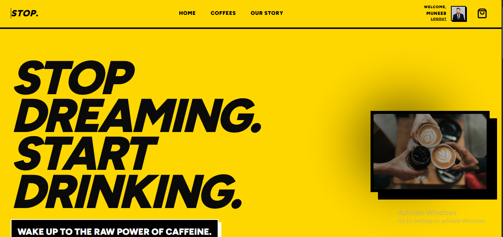
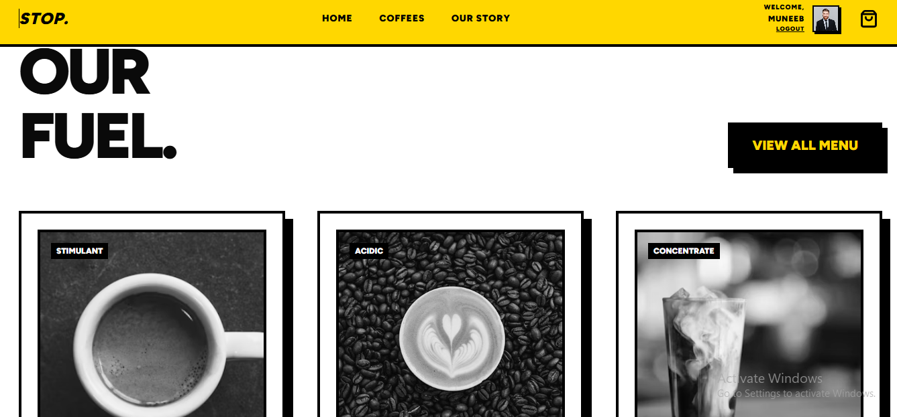
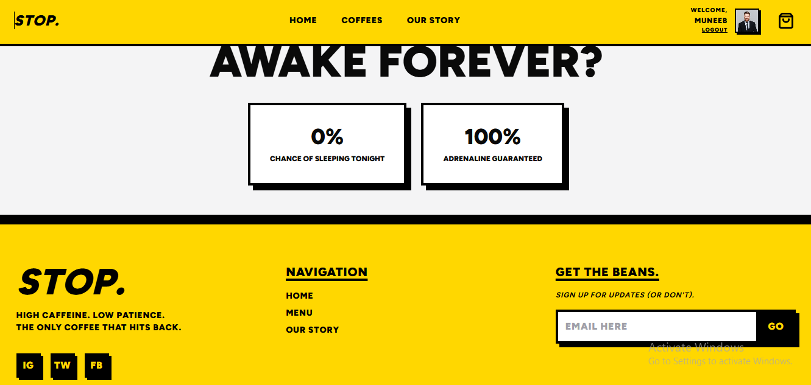
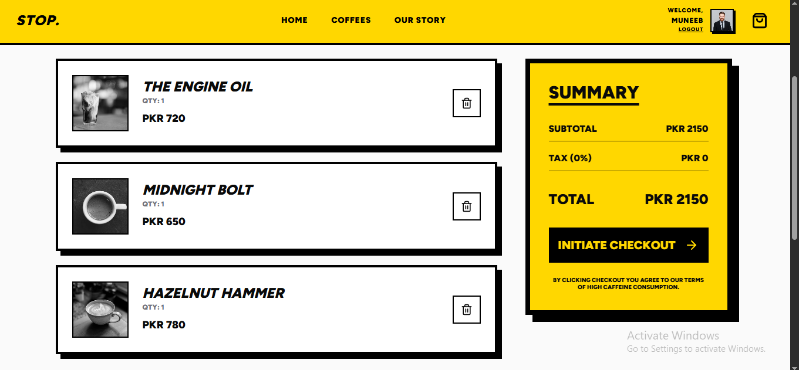
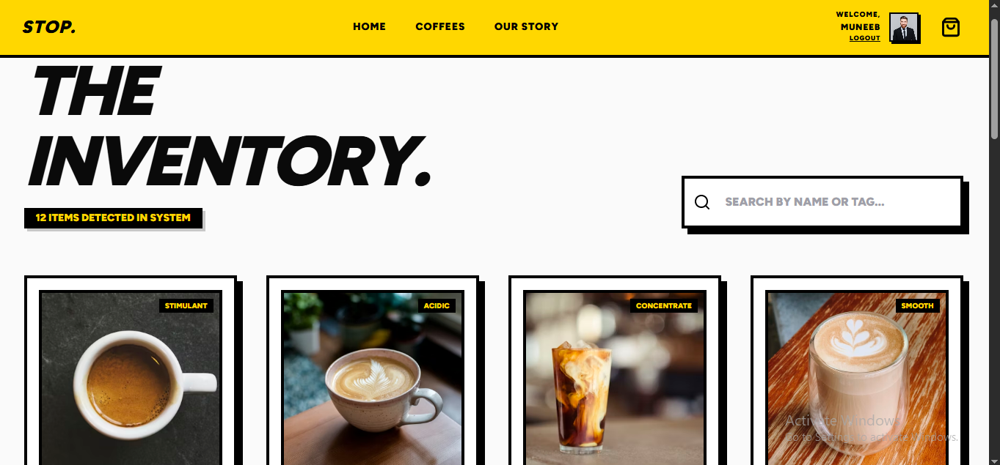
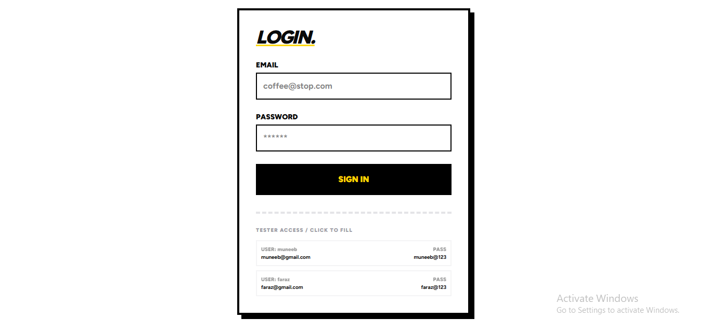
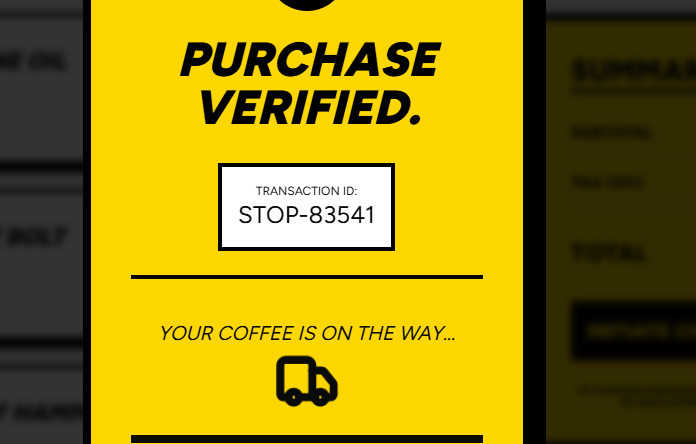
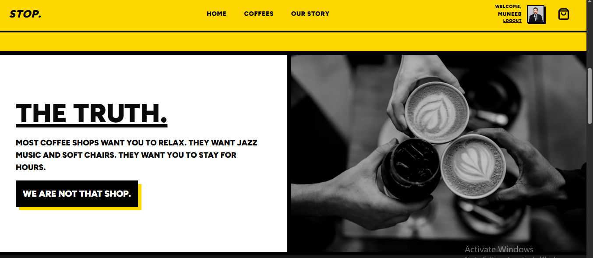

# ☕ STOP. // THE SYSTEM  
### ⚡ AN INDUSTRIAL COFFEE EXPERIENCE

> 🧠 **STOP.** is a high-performance, brutalist e-commerce interface built for those who treat caffeine as a system requirement.  
No fluff. No rounded corners. Just pure utility, sharp UI, and industrial-grade interaction.

---

## 📸 SYSTEM SNAPSHOTS

### 🏠 Landing / Hero Interface

  
  


---

### 🛒 Cart System (Live State Engine)



---

### 📦 Inventory Control System



---

### 🔐 Authentication Module



---

### 💳 Purchase Verification Flow



---

### 📖 Brand Story Interface



---

## 🛠 TECH STACK

- ⚛️ **React.js (Vite)** – Core frontend framework  
- 🧠 **Redux Toolkit** – Global state management (Auth + Cart system)  
- 🎨 **Tailwind CSS** – Brutalist UI styling system  
- 🧩 **Shadcn UI** – Accessible UI components  
- 📝 **React Hook Form** – Form handling  
- 🔍 **Zod** – Schema validation  
- 🎯 **Lucide Icons** – Modern icon system  
- 🔀 **React Router DOM** – Client-side routing  

---

## 🚀 CORE FEATURES

### 🔐 Authentication System
- Login / Logout state handled via Redux Toolkit  
- Persistent user session management  
- Scalable auth architecture for future backend integration  

---

### 🛒 Cart Engine
- Add / Remove / Update quantity  
- Real-time cart calculation  
- Fully global Redux-powered state  

---

### 📦 Inventory System
- ⚡ Instant search filtering  
- 🧊 Brutalist card-based UI  
- 🖱️ One-click add-to-cart interaction  

---

### 💳 Purchase Flow
- Order confirmation UI  
- Verification screen for completed purchases  
- Clean UX feedback loop  

---

### 💬 Quotes Generator (Async Thunk + Dummy JSON)

A dynamic quote generator built using **Redux Toolkit Async Thunk**, fetching data from a dummy JSON API.

#### ⚡ Features:
- Fetch quotes asynchronously using `createAsyncThunk`
- Handles **loading, success, and error states**
- Fully integrated with Redux global state
- Clean UI rendering of fetched quotes

#### 🧠 How it works:

```js
import { createAsyncThunk } from "@reduxjs/toolkit";

export const fetchQuotes = createAsyncThunk(
  "quotes/fetchQuotes",
  async () => {
    const res = await fetch("https://dummyjson.com/quotes");
    const data = await res.json();
    return data.quotes;
  }
);
